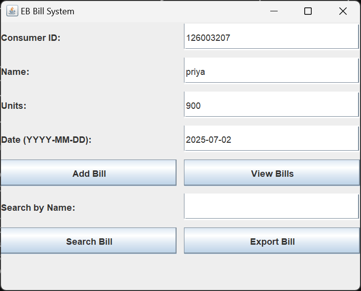

#  EB Bill Management System (Java + C++)

This is a complete **Electricity Bill Management System** that uses **Java (Swing GUI)** for the frontend and **C++** for the backend.  
It allows bill creation, viewing, searching, and exporting consumer electricity bills, with data stored in a shared file system.

---

##  Features

###  Java GUI (Frontend)
- Enter Consumer ID, Name, Units Consumed, and Date
- Auto-calculates the bill amount based on units
- View all bills in a scrollable popup
- Search bills by Consumer ID
- Export individual bills to text files

###  C++ Backend (Terminal)
- Console-based menu system: Add, View, Exit
- Adds bills and stores in the same file used by Java GUI
- View all stored bill records via terminal

---

##  Folder Structure

EBBillSystem/
├── backend/
│ └── ebill.cpp # C++ backend logic
├── frontend/
│ └── EBillGUI.java # Java Swing GUI
├── ebills.txt # Shared file storage
├── screenshots/ # GUI & Terminal images
└── README.md # Project documentation


---

##  Screenshots

### Java GUI – Main Interface


### Java – Adding Bill


### Java – View Bills


### Java – Search Result


### Java – Export Result


### C++ – Terminal Backend


---

## Running Java GUI

```bash
cd frontend
javac EBillGUI.java
java EBillGUI

## Author
Sathiyasri R.
Department of Computer Science and Engineering
SASTRA University, Tamil Nadu, India
GitHub: SathiyasriRaman

##  Disclaimer
This project is intended purely for learning and portfolio purposes.
It does not contain any confidential or proprietary data.
The author retains rights to the design and structure of this system.
